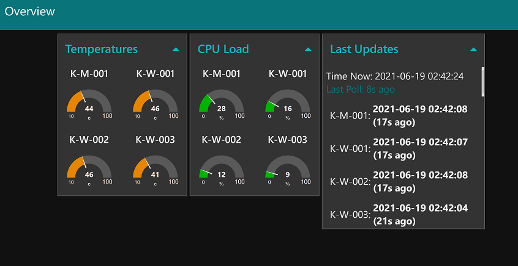

# Telemetry Daemon

Sends useful stats of the host to a endpoint of your choosing in JSON format.

## Install
```
git clone https://github.com/Slyke/TelemetryDaemon.git
```

## Notes
* CLI params take priority over environment variables
* `{}` = Default value
* `[]` = Required value

## Usage [Environment Variables]
* `PORT`                = {"1880"}    - Port of remote host
* [`HOSTNAME`]                        - Hostname of remote host
* `ROUTE`               = {""}        - Path on remote host
* `HTTP`                = {"false"}   - Use HTTP instead of HTTPS
* `METHOD`              = {"POST"}    - HTTP request method
* `USERNAME`            = {empty}     - Basic auth username
* `PASSWORD`            = {empty}     - Basic auth password
* `PASSWORD`            = {empty}     - Basic auth password
* `FILTER`              = {empty}     - If set, only return these objects (See filters section)
* `OUTPUTRESULT`        = {false}     - If true, prints what is sent to server
* `OUTPUTRESPONSE`      = {false}     - If true, prints the server's reply

## Usage [CLI Params]
* `--port`              = {"1880"}    - Port of remote host
* [`--hostname`]                      - Hostname of remote host
* `--route`             = {""}        - Path on remote host
* `--http`              = {"false"}   - Use HTTP instead of HTTPS
* `--method`            = {"POST"}    - HTTP request method
* `--username`          = {empty}     - Basic auth username
* `--password`          = {empty}     - Basic auth password
* `--filter`            = {empty}     - If set, only return these objects (See filters section)
* `--output-result`     = {false}     - If true, prints what is sent to server
* `--output-response`   = {false}     - If true, prints the server's reply
* `-h`|`--help`                       - Show this menu

## Examples
Basic:
```
npm start --hostname "yourserver.com" --route "/telemetry"
```

With Filters and http:
```
npm start --hostname "yourserver.com" --route "/telemetry" --http true --filters "os,node,bios,temp"
```

With Filters and output result:
```
npm start --hostname "yourserver.com" --route "/telemetry" --filters "os,node,bios,temp" --output-result true
```

## Filters:
You can apply these using the `--filters` argument. You can list more than one by using commas `,` to separate them.
```
version
system
bios
baseboard
chassis
os
uuid
versions
cpu
graphics
net
memLayout
diskLayout
time
node
v8
cpuCurrentSpeed
battery
services
wifiNetworks
currentLoad
disksIO
fsSize
temp
users                 - Not necessary
networkConnections    - Very large
fsStats
networkStats
mem
processes             - Very large
inetLatency
```

Do note that `users`, `networkConnections` and `processes` are not included by default, but you can manually specify them if you want.

On lower powered machines NodeJS may crash, or fail to send the entire JSON data if the payload is too large.

## Cronjob
There's a script to help facilitate NodeJS installation, and insertion into crontab, you can run it with:
```
bash ./install_cron.sh
```
To manually update crontab, and have the script execute every 2 minutes: `crontab -e`
```
*/2 *  *  *  * /path/to/node /home/you/TelemetryDaemon/index.js --hostname "yourserver.com" --route "/telemetry"
```

## Docker
You can run this inside docker, but it may not be able to get all details about the host. Pass the `--privileged` flag to Docker to allow for more details.

## Example output of setup with NodeRed:


## Credit:
This uses [SystemInformation](https://github.com/sebhildebrandt/systeminformation) which is a cross platform, dependency free npm module.